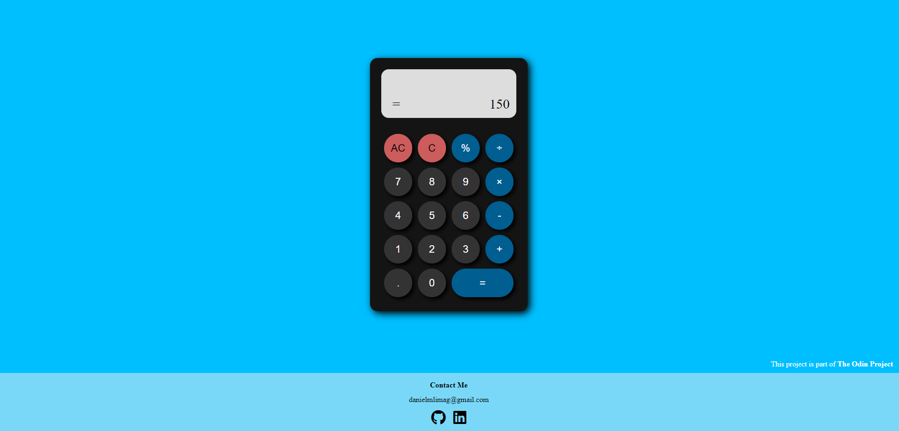

# Calculator

## Introduction
This project consists on a calculator built with plain HTML, CSS and Javascript  
and it is part of [The Odin Project](https://www.theodinproject.com/).

## Screenshot

## Live Demo
This project is hosted in my GitHub Pages and you can access it [in here](https://daniellima0.github.io/calculator/).

## Key Concepts
* DOM Manipulation
* Event Listeners
